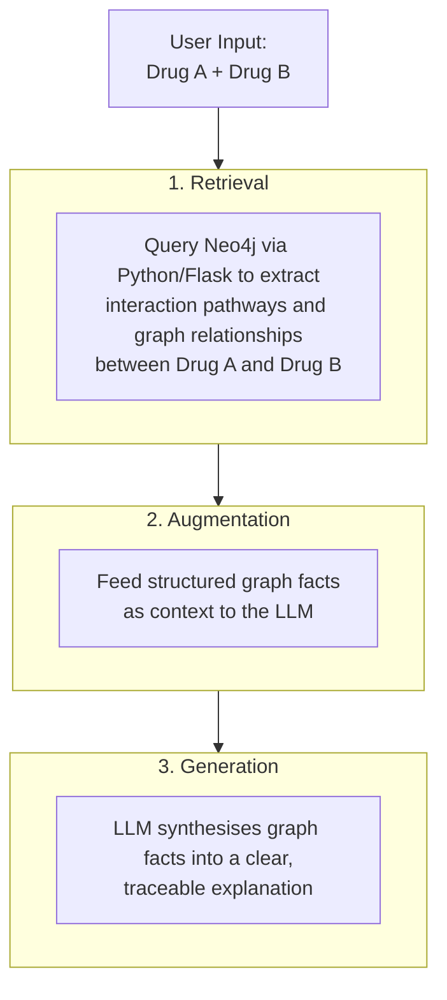

# 🛡️ MediGuard AI Assistant
**Bridging the Healthcare Gap with Gemini 2.5 Flash & Neo4j Knowledge Graphs**

[](https://www.python.org/)
[](https://flask.palletsprojects.com/)
[](https://deepmind.google/technologies/gemini/)
[](https://neo4j.com/)

## 🌟 Our Philosophy: Beyond "Patient" Safety
We believe that health is a daily journey, not just a response to illness. Most people managing health needs aren't "patients"—they are proactive individuals looking for clarity. 

- **Breaking the Information Barrier**: We believe professional medical insights should be a public right, not a specialized privilege.
- **Simplification for Equity**: By making medical reports easy to understand, we empower everyone—regardless of their educational background—to make informed decisions about their own bodies.
- **Human-Centric Tech**: We combine the "logic" of Graph Databases with the "empathy" of LLMs to create a tool that speaks your language.

---

## 🗺️ Roadmap
- [x] **Phase 1**: Core Drug-Drug Interaction (DDI) engine with Neo4j.
- [x] **Phase 2**: Real-time medication scanning UI.
- [ ] **Phase 3**: Medical Report Translation (Jargon-to-Human) — *Leveraging Gemini 2.5 Flash to simplify complex medical terminology into actionable daily insights.*

---

## 🚀 Key Capabilities

### 1. Intelligent Drug-Drug Interaction (DDI) Analysis
Leveraging the structured logic of **Neo4j**, MediGuard maps complex relationships between various medications. It identifies potential risks not just by name, but by analyzing active ingredients and metabolic pathways, ensuring that daily health management is backed by rigorous data.

### 2. Medical Report Translation (Upcoming) 
Aiming to bridge the information gap where medical reports are filled with intimidating terminology. This upcoming feature will use **Gemini 2.5 Flash** to "translate" professional reports into clear, empathetic, and human-readable language.
* **Understandable**: No more confusing acronyms or Latin terms.
* **Actionable**: Clear insights that help you make informed daily health decisions.

### 3. RAG Architecture: How It Works
The diagram below illustrates the end-to-end RAG pipeline that powers MediGuard's explainable outputs:


    
---

## 📺 Live Demo
[](https://www.youtube.com/watch?v=ti-1i4NOsj8)
*Click the image above to watch how MediGuard simplifies healthcare.*

---

## 📂 Project Structure
```text
MediGuard-AI-Assistant/
├── frontend/         # UI Components (HTML5, Tailwind CSS, JS)
├── backend/          # API Engine (Flask, Gemini 2.5, Py2neo)
├── database/         # Knowledge Graph Data (CSV files)
├── requirements.txt  # Python Dependencies
└── README.md         # Project Documentation
