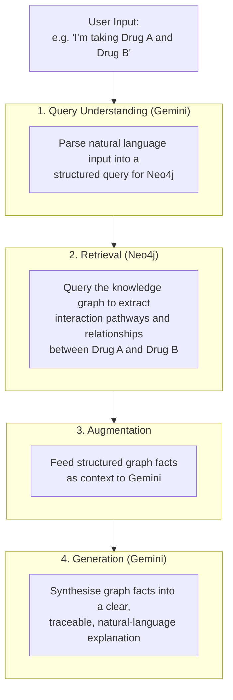

# 🛡️ MediGuard AI Assistant
**Bridging the Healthcare Gap with Gemini 2.5 Flash & Neo4j Knowledge Graphs**

[](https://www.python.org/)
[](https://flask.palletsprojects.com/)
[](https://deepmind.google/technologies/gemini/)
[](https://neo4j.com/)

## 🌟 Our Philosophy: Beyond "Patient" Safety
We believe that health is a daily journey, not just a response to illness. Most people managing health needs aren't "patients"—they are proactive individuals looking for clarity. 

- **Making Interactions Understandable**: We believe drug interaction risks shouldn't require a medical degree to understand — everyone should be able to check their own medications with confidence.
- **Transparency by Design**: Every insight MediGuard surfaces can be traced back to its source in the knowledge graph — no black-box answers, just explainable reasoning you can verify.

---

## 🗺️ Roadmap
- [x] **Phase 1**: Core Drug-Drug Interaction (DDI) engine with Neo4j.
- [x] **Phase 2**: Real-time medication scanning UI.
- [ ] **Phase 3**: Extend beyond drug-drug interactions to surface disease-progression and lab-indicator insights (e.g. hypertension → chronic kidney disease pathways) already modelled in the knowledge graph.
---

## 🚀 Key Capabilities

### 1. Intelligent Drug-Drug Interaction (DDI) Analysis
Leveraging the structured logic of **Neo4j**, MediGuard maps documented drug-drug contraindications, severity classifications, and clinical guidance between medications, providing risk information backed by a structured knowledge graph.

### 2. RAG Architecture: How It Works
The diagram below illustrates the end-to-end RAG pipeline that powers MediGuard's explainable outputs:



---

## 📺 Live Demo
[](https://www.youtube.com/watch?v=ti-1i4NOsj8)
*Click the image above to watch how MediGuard simplifies healthcare.*

---

## 📂 Project Structure
```text
MediGuard-AI-Assistant/
├── frontend/         # UI Components (HTML5, CSS, JS)
├── backend/          # API Engine (Flask, Gemini 2.5, Py2neo)
├── database/         # Knowledge Graph Data (CSV files)
├── requirements.txt  # Python Dependencies
└── README.md         # Project Documentation
